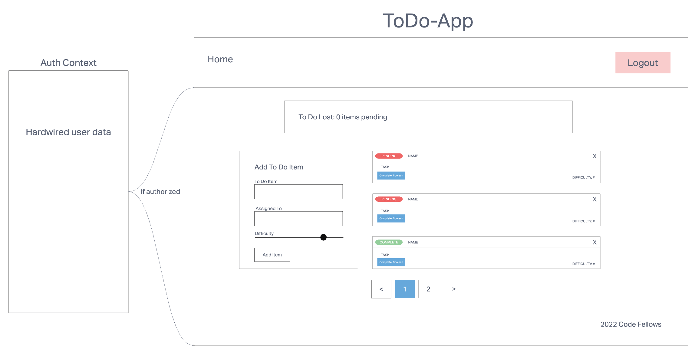

# LAB - Class 31-32

## Project: To Do App

### Author: KC Hofstetter (With help from Ryan Gallaway, I followed along during some lecture time)

### Problem Domain

A Web Application for securely managing a To Do List

The To Do Manager application has the following overall requirements:

- Designed to match the mock-up
  - Header, Main Section Footer
  - Use Mantine for styling and visual components
- The header should present the main menu
  - Home Link, which shows the list of To Do Items
- In the “Main” section
  - Nothing should be visible until a user has logged in successfully
  - The list of items in the to do list
    - Based on user preferences, show listings in groups of (3, 5, etc) and provide the ability to view multiple “pages” of results
    - Each item in list should show the text of the item as well as the assignee
      - Based on user preferences, hide or show completed items
      - If shown, completed items should be styled differently making their status visually obvious
    - For users with “Update” permissions
      - When an item is clicked, toggle the “complete” status of the item.
    - For users with “Delete” permissions
      - Items should have a delete button associated with them
        - When clicked, remove the item from the list
  - For users with “Create” permissions …
    - A Form where the user can add a new item to the todo list
      - Items should have the following fields:
        - To Do Item Text
        - Assigned To
        - Status (complete/incomplete)
        - Difficulty (number between 1 and 5)

### Links and Resources

- [ci/cd](https://github.com/khofstetter94/todo-app/pull/9)
- [front-end application](https://animated-medovik-9e9e48.netlify.app/)

#### How to initialize/run your application

- `npm start`

#### Features / Routes

- The application will be created with the following overall architecture and methodologies

  - React
  - Functional Components
  - Settings delivered to the application using Context
  - User Login & Permissions delivered to the application using Context
  - Local Storage / Cookies for storing login status
  - Local Storage / Cookies for storing user preferences
  - Axios for performing API Requests
  - Mantine Component Library for styling
  - Test Driven Development, using Jest
  - Tests will be runnable locally
  - Deployment to cloud provider

#### Tests

- 'npm test auth.test.js'

#### Documentation

- Describe how global state is consumed by the components
- Describe the operation of the hook: useForm()

#### UML

